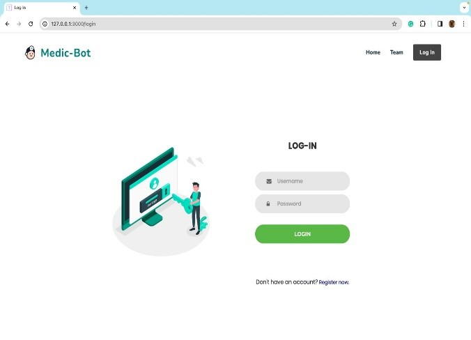

# Self_Learning_Bot
## Overview
This project aims to develop a ChatBot specialized in the medical domain to assist users in identifying diseases based on symptoms, providing information about symptoms for specific diseases, and offering details about the nearest hospitals for a particular disease.




## Methodologies
1. Data Collection and Preparation
Describe how medical data was collected, including sources and methods.
Explain data preprocessing techniques applied to clean and prepare the data for training.
2. Natural Language Processing (NLP)
Discuss NLP techniques used for understanding and processing user queries related to symptoms and diseases.
Detail any text processing, tokenization, or parsing methods employed.
3. Machine Learning and Deep Learning Models
Provide an overview of the machine learning and deep learning models utilized.
Explain the architecture of the models and their training process.
4. Reinforcement Learning and Feedback Loop
Discuss how reinforcement learning techniques are integrated to improve the ChatBot's responses over time.
Explain the feedback loop mechanism for continuous learning and adaptation.
5. Iterative Development and Evaluation
Describe the iterative development process followed to improve the ChatBot's performance.
Discuss evaluation metrics and methodologies used to assess the ChatBot's effectiveness.
## Functionality
### Disease Identification
- The ChatBot utilizes a trained model, based on the Random Forest algorithm, to identify diseases based on user-provided symptoms.
- For example, when the user describes symptoms such as high fever, mild headache, and cold, the ChatBot analyzes the input and provides the corresponding disease name.
- The ChatBot then retrieves the nearest hospital details based on the user's location and provides them as a link for further assistance.
### Symptom Information
- Symptom information is retrieved from a CSV file provided to the model during training.
- The ChatBot accesses this dataset to provide users with accurate information about symptoms associated with specific diseases.
- Users can inquire about symptoms related to particular diseases, and the ChatBot responds with relevant details sourced from the training data.
### Nearest Hospital Details
- The ChatBot retrieves details about the nearest hospitals from the Practo website.
- Integration with external services or APIs allows the ChatBot to fetch real-time hospital information based on the user's location.
- Users receive a link to the nearest hospital, enabling them to access essential medical assistance promptly.
- Feel free to adjust the wording or add more details as needed.
## Usage
1. Clone this Repo and change directory to medicbot.
2. Install all the dependencies
3. Run app.py file: 
``` python
python app.py 
```
## Dependencies
* __Flask__: Web framework used for developing the ChatBot's backend API.  
   - Installation: 
    ``` python
    pip install flask
    ```
* __Flask-SQLAlchemy__: Extension for Flask that adds support for SQLAlchemy, a Python SQL toolkit and Object-Relational Mapper (ORM).
  - Installation: 
  ``` python
  pip install flask_sqlalchemy
  ```
- __Jinja2__: Template engine for Python used in Flask for rendering HTML templates.
  - Installation: 
  ``` python
  pip install jinja2
  ```
  
- **numpy**: Library for the Python programming language, adding support for large, multi-dimensional arrays and matrices, along with a large collection of high-level mathematical functions to operate on these arrays.
  - Installation: 
  ```python
  pip install  numpy
  ```
  
- **Pillow**: Python Imaging Library adds image processing capabilities to your Python interpreter.
  - Installation: 
  ```python
  pip install pillow
  ```
  
- **requests**: HTTP library for Python, allowing you to send HTTP requests easily.
  - Installation: 
  ```
  pip install --user requests
  ```
  
- **Werkzeug**: A comprehensive WSGI web application library for Python.
  - Installation: 
  ```
  pip install werkzeug
  ```
* __SQLAlchemy__: Python SQL toolkit and Object-Relational Mapper (ORM) used for database interactions.
    - Installation: 
    ``` python
    pip install sqlalchemy
    ```
* __duckduckgo_search__: used for performing web searches using the DuckDuckGo search engine.
  - Installation: 
  ``` python
  pip install duckduckgo_search==3.5
  ```


## Support
If you encounter any issues or have questions about the Self Learning Chatbot Project, please feel free to [create an issue](https://github.com/Krishnann-s/Self_Learning_Bot/issues).

## Contributors
[Krishnan](https://github.com/Krishnann-s)  
[Rihan Anwar C A](https://github.com/Rihan312)  
[Mohammed Imthihyaz](https://github.com/Mohammed-Imthihyaz)  
[Ambrish Kumar S](https://github.com/Ambrish9535)  